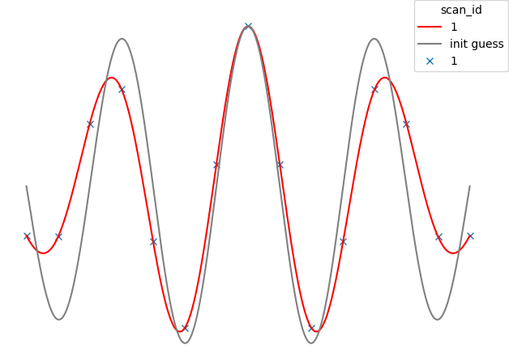
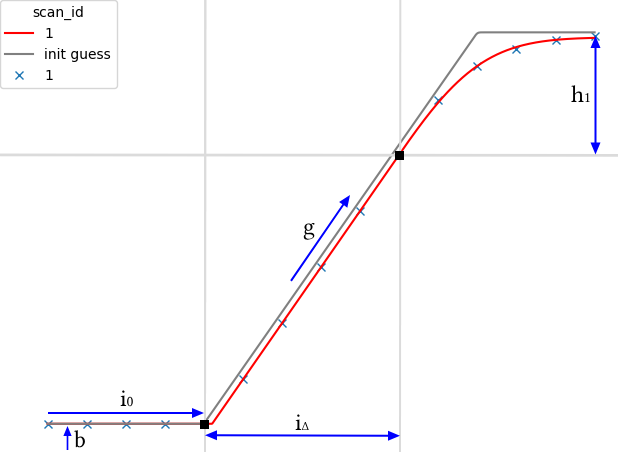
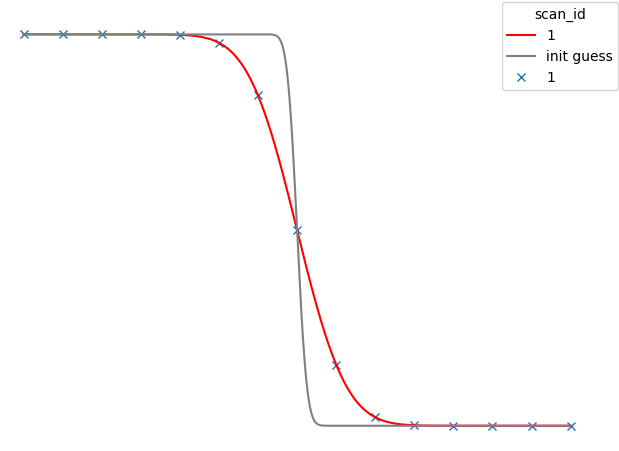
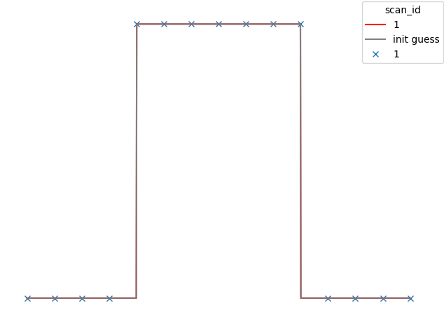
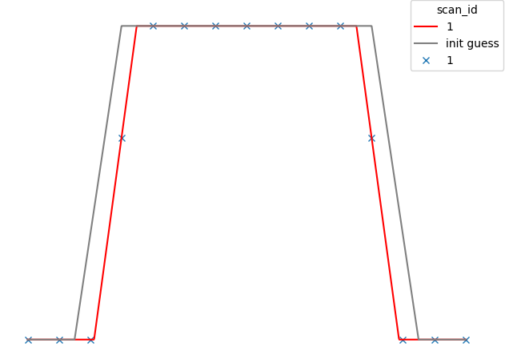
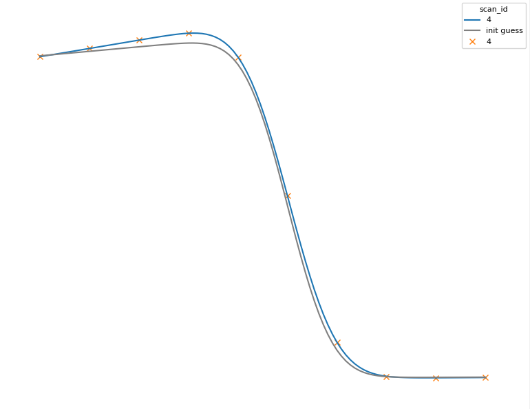

{#standard_fitting_models}
# Standard Fitting Models

## Linear

API Reference: [`Linear`](ibex_bluesky_core.fitting.Linear)

- `c1` - Gradient
- `c0` - (y) Intercept

```{math}
y = c_1x + c_0
```

## Polynomial

API Reference: [`Polynomial`](ibex_bluesky_core.fitting.Polynomial)

- `cn` ... `c0` - Polynomial coefficients

For a polynomial degree `n`:
```{math}
y = c_{n}x^n + c_{n-1}x^{n-1} + ... + c_1 * x^1 + c_0 
```

## Gaussian

API Reference: [`Gaussian`](ibex_bluesky_core.fitting.Gaussian)

- `amp` - The maximum height of the Gaussian above `background`
- `sigma` - A scalar for Gaussian width
- `x0` - The centre (x) of the Gaussian
- `background` - The minimum value (y) of the Gaussian

```{math}
y = \text{amp} * e^{-\frac{(x - x0) ^ 2}{2 * \text{sigma}^2}} + \text{background}
```


## Lorentzian

API Reference: [`Lorentzian`](ibex_bluesky_core.fitting.Lorentzian)

- `amp` - The maximum height of the Lorentzian above `background`
- `sigma` - A scalar for Lorentzian width
- `center` - The centre (x) of the Lorentzian
- `background` - The minimum value (y) of the Lorentzian

```{math}
y = \frac{\text{amp}}{1 + \frac{x - \text{center}}{\text{sigma}}^2} + \text{background}
```


## Damped Oscillator (DampedOsc)

API Reference: [`DampedOsc`](ibex_bluesky_core.fitting.DampedOsc)

- `center` - The centre (x) of the oscillation
- `amp` - The maximum height of the curve above 0
- `freq` - The frequency of the oscillation
- `width` - How far away from the centre will oscillations last for

```{math}
y = \text{amp} * \cos((x - \text{center}) * \text{freq}) * e^{-\frac{x - \text{center}}{\text{width}^ 2}}
```



##  Slit Scan (SlitScan)

API Reference: [`SlitScan`](ibex_bluesky_core.fitting.SlitScan)

- `background` $b$ - The minimum value (y) of the model
- `inflection0` $i_0$ - The x coord of the first inflection point
- `gradient` $g$ - The gradient of the sloped-linear section of the model
- `inflections_diff` $i_{\Delta}$ - The x displacement between the two inflection points
- `height_above_inflection1` $h_1$ - The y displacement between inflection 1 and the model's asymptote

```{math}
\text{exp_seg} = h_1 \cdot \text{erf} \left( g \cdot \frac{\sqrt{\pi}}{2h_1} \cdot (x - i_0 - \Delta i) \right) + g \cdot \Delta i + b
```

```{math}
\text{lin_seg} = \max(b + g * (x - i_0), b)
```

```{math}
y = \min(\text{lin_seg}, \text{exp_seg})
```



## Error Function (ERF)

API Reference: [`ERF`](ibex_bluesky_core.fitting.ERF)

- `cen` - The centre (x) of the model
- `stretch` - A horizontal stretch factor for the model
- `scale` - A vertical stretch factor for the model
- `background` - The minimum value (y) of the model

```{math}
y = background + scale * erf(stretch * (x - cen))
```


## Complementary Error Function (ERFC)

API Reference: [`ERFC`](ibex_bluesky_core.fitting.ERFC)

- `cen` - The centre (x) of the model
- `stretch` - A horizontal stretch factor for the model
- `scale` - A vertical stretch factor for the model
- `background` - The minimum value (y) of the model

```{math}
y = background + scale * erfc(stretch * (x - cen))
```



## Top Hat (TopHat)

API Reference: [`TopHat`](ibex_bluesky_core.fitting.TopHat)

- `cen` - The centre (x) of the model
- `width` - How wide the 'hat' is
- `height` - The maximum height of the model above `background`
- `background` - The minimum value (y) of the model

```{math}
y = 
\begin{cases} 
\text{background} + \text{height}, & \text{if } |x - \text{cen}| < \frac{\text{width}}{2} \\
\text{background}, & \text{otherwise}
\end{cases}
```



## Trapezoid

API Reference: [`Trapezoid`](ibex_bluesky_core.fitting.Trapezoid)

- `cen` - The centre (x) of the model
- `gradient` - How steep the edges of the trapezoid are
- `height` - The maximum height of the model above `background`
- `background` - The minimum value (y) of the model
- `y_offset` - Acts as a width factor for the trapezoid. If you extrapolate the sides of the trapezoid until they meet above the top, this value represents the y coord of this point minus height and background.

```{math}
f(x) = \text{y_offset} + \text{height} + \text{background} - \text{gradient} * |x - \text{cen}|
```
```{math}
g(x) = \max(f(x), \text{background})
```
```{math}
y = \min(g(x), \text{background} + \text{height})
```



## Negative Trapezoid

API Reference: [`NegativeTrapezoid`](ibex_bluesky_core.fitting.NegativeTrapezoid)

This model is the same shape as the trapezoid described above, but with a negative height.

- `cen` - The centre (x) of the model
- `gradient` - How steep the edges of the trapezoid are
- `height` - The maximum height of the model below `background`
- `background` - The maximum value (y) of the model
- `y_offset` - Acts as a width factor for the trapezoid. If you extrapolate the sides of the trapezoid until they meet, this value represents the y coord of this point minus height and background.

```{math}
f(x) = \text{y_offset} - \text{height} + \text{background} + \text{gradient} * |x - \text{cen}|
```
```{math}
g(x) = \max(f(x), \text{background} - \text{height})
```
```{math}
y = \min(g(x), \text{background})
```

## Muon Momentum

API Reference: [`MuonMomentum`](ibex_bluesky_core.fitting.MuonMomentum)

Fits data from a momentum scan, it is designed for the specific use case of scanning over magnet current on muon instruments.

- `x0` - The center (x) of the model
- `w` - The horizontal stretch factor of the model
- `R` - The amplitude of the model
- `b` - The minimum value (y) of the model
- `p` - Changes the gradient of the tail ends of the model

``` {math}
y = \left (\text{erfc} \mathopen{} \left(\frac{x-x_0}{w} \right) \mathclose{} \cdot \frac{R}{2} + b \right) \cdot \left (\frac{x}{x_0} \right)^p
```


 