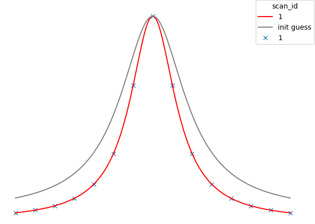
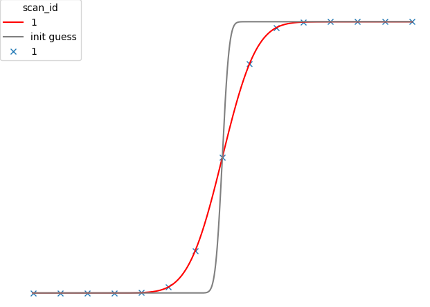
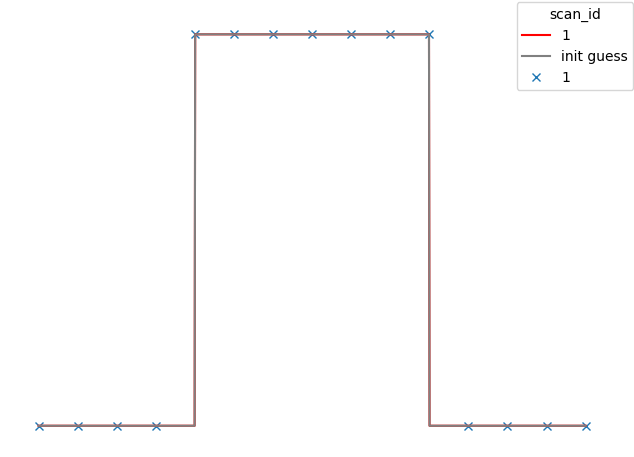

# Standard Fitting Models

## Linear

- `c1` - Gradient
- `c0` - (y) Intercept

```{math}
y = c_1x + c_0
```

## Polynomial

- `cn` ... `c0` - Polynomial coefficients

For a polynomial degree `n`:
```{math}
y = c_{n}x^n + c_{n-1}x^n-1 + ... + c_1 * x^1 + c_0 
```

## Gaussian

- `amp` - The maximum height of the Gaussian above `background`
- `sigma` - A scalar for Gaussian width
- `x0` - The centre (x) of the Gaussian
- `background` - The minimum value (y) of the Gaussian

```{math}
y = \text{amp} * e^{-\frac{(x - x0) ^ 2}{2 * \text{sigma}^2}} + \text{background}
```


## Lorentzian

- `amp` - The maximum height of the Lorentzian above `background`
- `sigma` - A scalar for Lorentzian width
- `center` - The centre (x) of the Lorentzian
- `background` - The minimum value (y) of the Lorentzian

```{math}
y = \frac{\text{amp}}{1 + \frac{x - \text{center}}{\text{sigma}}^2} + \text{background}
```



## Damped Oscillator (DampedOsc)

- `center` - The centre (x) of the oscillation
- `amp` - The maximum height of the curve above 0
- `freq` - The frequency of the oscillation
- `width` - How far away from the centre will oscillations last for

```{math}
y = \text{amp} * \cos((x - \text{center}) * \text{freq}) * e^{-\frac{x - \text{center}}{\text{width}^ 2}}
```


##  Slit Scan (SlitScan)

- `background` $b$ - The minimum value (y) of the model
- `inflection0` $i_0$ - The x coord of the first inflection point
- `gradient` $g$ - The gradient of the sloped-linear section of the model
- `inflections_diff` $i_{\Delta}$ - The x displacement between the two inflection points
- `height_above_inflection1` $h_1$ - The y displacement between inflection 1 and the model's asymptote

```{math}
\text{exp_seg} = h_1 \cdot \text{erf} \left( g \cdot \frac{\sqrt{\pi}}{2h_1} \cdot (x - i_0 - \Delta i) \right) + g \cdot \Delta i + b
```

```{math}
\text{lin_seg} = \max(b + g * (x - i_0), b)
```

```{math}
y = \min(\text{lin_seg}, \text{exp_seg})
```


## Error Function (ERF)

- `cen` - The centre (x) of the model
- `stretch` - A horizontal stretch factor for the model
- `scale` - A vertical stretch factor for the model
- `background` - The minimum value (y) of the model

```{math}
y = background + scale * erf(stretch * (x - cen))
```



## Complementary Error Function (ERFC)

- `cen` - The centre (x) of the model
- `stretch` - A horizontal stretch factor for the model
- `scale` - A vertical stretch factor for the model
- `background` - The minimum value (y) of the model

```{math}
y = background + scale * erfc(stretch * (x - cen))
```


## Top Hat (TopHat)

- `cen` - The centre (x) of the model
- `width` - How wide the 'hat' is
- `height` - The maximum height of the model above `background`
- `background` - The minimum value (y) of the model

```{math}
y = 
\begin{cases} 
\text{background} + \text{height}, & \text{if } |x - \text{cen}| < \frac{\text{width}}{2} \\
\text{background}, & \text{otherwise}
\end{cases}
```



## Trapezoid

- `cen` - The centre (x) of the model
- `gradient` - How steep the edges of the trapezoid are
- `height` - The maximum height of the model above `background`
- `background` - The minimum value (y) of the model
- `y_offset` - Acts as a width factor for the trapezoid. If you extrapolate the sides of the trapezoid until they meet above the top, this value represents the y coord of this point minus height and background.

```{math}
f(x) = \text{y_offset} + \text{height} + \text{background} - \text{gradient} * |x - \text{cen}|
```
```{math}
g(x) = \max(f(x), \text{background})
```
```{math}
y = \min(g(x), \text{background} + \text{height})
```

