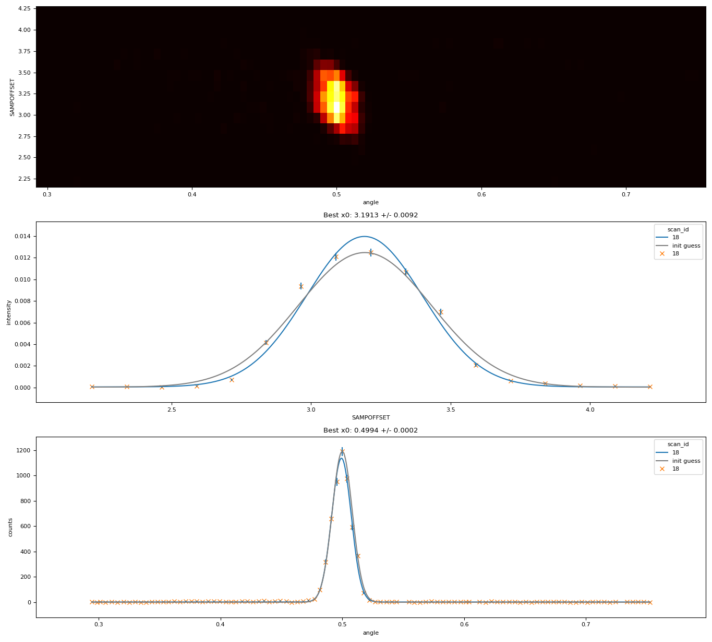

# Detector-mapping alignment

Plans described in this section provide support for detector-mapping alignment on reflectometers.

The plans in this module expect:
- A DAE collecting in period-per-point mode. A suitable controller is 
{py:obj}`~ibex_bluesky_core.devices.simpledae.PeriodPerPointController`.
- A DAE configured to reduce data by exposing all spectrum integrals. A suitable reducer is 
{py:obj}`~ibex_bluesky_core.devices.simpledae.PeriodSpecIntegralsReducer`.
- An angle map, as a {py:obj}`numpy.ndarray` array with dtype `float64`, which has the same dimensionality as the set of selected detectors. This
maps each configured detector pixel to its angular position.
- An optional flood map, as a {external+scipp:py:obj}`scipp.Variable`. This should have a dimension label of "spectrum"
and have the same dimensionality as the set of selected detectors. This array may have variances. This is used to
normalise pixel efficiencies: raw counts are divided by the flood to get scaled counts. If no flood map is provided, no
normalisation will be performed.

## Angle scan

API reference: {py:obj}`ibex_bluesky_core.plans.reflectometry.angle_scan_plan`

This plan takes a single DAE measurement, without moving anything.

The resulting plots and data files describe the relationship between angular position of each detector pixel,
and the counts observed on that detector pixel - with the aim of finding the angle at which peak intensity
occurs.

This plan returns the result of the angle fit, or `None` if the fit failed. The model used is a 
{py:obj}`~ibex_bluesky_core.fitting.Gaussian`.

The following is a full example of how {py:obj}`~ibex_bluesky_core.plans.reflectometry.angle_scan_plan`
may be called, configuring an appropriate {py:obj}`~ibex_bluesky_core.devices.simpledae.SimpleDae`.

<details>
<summary>Click to show example code</summary>

```python
from collections.abc import Generator

import numpy as np
from bluesky.utils import Msg
from lmfit.model import ModelResult

from ibex_bluesky_core.utils import get_pv_prefix
from ibex_bluesky_core.devices.simpledae import (
    PeriodGoodFramesWaiter,
    PeriodPerPointController,
    PeriodSpecIntegralsReducer,
    SimpleDae
)
from ibex_bluesky_core.plans.reflectometry import angle_scan_plan


def map_align_plan() -> Generator[Msg, None, ModelResult | None]:
    controller = PeriodPerPointController(save_run=True)
    waiter = PeriodGoodFramesWaiter(50)
    reducer = PeriodSpecIntegralsReducer(
        # Select spectrum 1 as the monitor
        monitors=np.array([1], dtype=np.int64),
        # and 2-128 inclusive as the detectors
        detectors=np.arange(2, 129),
    )

    prefix = get_pv_prefix()
    dae = SimpleDae(
        prefix=prefix,
        controller=controller,
        waiter=waiter,
        reducer=reducer,
    )

    angle_scan_result = yield from angle_scan_plan(
        dae,
        angle_map=np.linspace(-5, 5, num=127, dtype=np.float64),
    )

    if angle_fit := angle_scan_result:
        print(angle_fit.fit_report(show_correl=False))

    return angle_scan_result
```

</details>

---

## Height & angle scan

API reference: {py:obj}`ibex_bluesky_core.plans.reflectometry.height_and_angle_scan_plan`

This plan scans over a provided height axis, taking a DAE measurement at each point. It then
does simultaneous height and angle fits, using a single set of measurements - avoiding the need
to scan height and angle separately.



It is assumed that the optimum angle (integrated over all height points) and the optimum height (integrated over all selected pixels) is the best location for both height and angle. If this assumption is untrue, then the result of this plan is meaningless.

This plan produces multiple plots & data files from a single scan:
- A heatmap visualising the 2-dimensional relationship between angle (x axis), height (y axis), and measured
intensity (heatmap colour).
- A set of plots & data files describing the relationship between integrated intensity (across 
every configured detector pixel, normalized by monitor), versus height.
- A set of plots & data files describing the relationship of accumulated counts on each detector pixel,
across all height points, versus angular pixel position. The only difference between this and the `angle_scan`
plan above is that this accumulates data across multiple height points, and therefore benefits from the
counting statistics of all measured height points.

This plan returns a typed dictionary, {py:obj}`~ibex_bluesky_core.plans.reflectometry.DetMapAlignResult`, with the following keys:
- `"angle_fit"`: the result of the angle fit, or `None` if the fit failed.
- `"height_fit"`: the result of the height fit, or `None` if the fit failed.

Both the height & angle data are fitted using two independent
{py:obj}`~ibex_bluesky_core.fitting.Gaussian` models.

The following is a full example of how {py:obj}`~ibex_bluesky_core.plans.reflectometry.height_and_angle_scan_plan`
may be called, configuring an appropriate {py:obj}`~ibex_bluesky_core.devices.simpledae.SimpleDae` and a
{py:obj}`~ibex_bluesky_core.devices.block.BlockRw`.

<details>
<summary>Click to show example code</summary>

```python
from collections.abc import Generator

import numpy as np
from bluesky.utils import Msg

from ibex_bluesky_core.utils import get_pv_prefix
from ibex_bluesky_core.devices.block import block_rw
from ibex_bluesky_core.devices.simpledae import (
    PeriodGoodFramesWaiter,
    PeriodPerPointController,
    PeriodSpecIntegralsReducer,
    SimpleDae
)
from ibex_bluesky_core.plans.reflectometry import (
    DetMapAlignResult,
    height_and_angle_scan_plan
)


def map_align() -> Generator[Msg, None, DetMapAlignResult]:
    # Could also be a reflectometry parameter, or any other movable
    block = block_rw(float, "some_block")

    controller = PeriodPerPointController(save_run=True)
    waiter = PeriodGoodFramesWaiter(50)
    reducer = PeriodSpecIntegralsReducer(
        # Select spectrum 1 as the monitor
        monitors=np.array([1], dtype=np.int64),
        # and 2-128 inclusive as the detectors
        detectors=np.arange(2, 129),
    )

    prefix = get_pv_prefix()
    dae = SimpleDae(
        prefix=prefix,
        controller=controller,
        waiter=waiter,
        reducer=reducer,
    )

    result = yield from height_and_angle_scan_plan(
        dae,
        block,
        5,
        15,
        num=21,
        angle_map=np.linspace(-5, 5, num=127, dtype=np.float64),
    )

    print("Height fit:")
    if height_fit := result["height_fit"]:
        print(height_fit.fit_report(show_correl=False))
    print("\n\n")
    print("Angle fit:")
    if angle_fit := result["angle_fit"]:
        print(angle_fit.fit_report(show_correl=False))
    print("\n\n")

    return result
```

</details>

---

## Implementation

The following specialised components are used to implement the detector-mapping alignment workflow:

### {py:obj}`~ibex_bluesky_core.devices.simpledae.PeriodSpecIntegralsReducer`

{py:obj}`~ibex_bluesky_core.devices.simpledae.PeriodSpecIntegralsReducer`
is responsible for exposing arrays of DAE detector data. 

It exposes numpy arrays of integer counts data from the current period, integrated over the entire time-of-flight
dimension. This reducer is implemented by pulling the entire spectrum-data map from the DAE at once, so is efficient
even for relatively large numbers of detectors.

This reducer cannot be used by itself in a scan, as it does not produce scalar data. It is only intended for use with
downstream processors, such as 
{py:obj}`~ibex_bluesky_core.callbacks.reflectometry.DetMapHeightScanLiveDispatcher`
or
{py:obj}`~ibex_bluesky_core.callbacks.reflectometry.DetMapAngleScanLiveDispatcher`
described below.

This reducer always accumulates data across the entire configured time-of-flight range - this is because it uses the
spectrum-data map rather than reading individual spectra, and the spectrum-data map does not have access to time
channel boundary information. For efficiency, if slicing data in time-of-flight or wavelength is desired, this should
be done by changing DAE time-channel settings.

```{warning}
`num_periods * (num_spectra + 1) * (num_time_channels + 1)` may not exceed {math}`5000000`.

This is a limitation of the underlying EPICS spectrum-data map used to implement this reducer.
```

### {py:obj}`~ibex_bluesky_core.callbacks.reflectometry.DetMapHeightScanLiveDispatcher`

{py:obj}`~ibex_bluesky_core.callbacks.reflectometry.DetMapHeightScanLiveDispatcher`
is a bluesky {py:obj}`~bluesky.callbacks.stream.LiveDispatcher` which processes arrays generated by 
{py:obj}`PeriodSpecIntegralsReducer<ibex_bluesky_core.devices.simpledae.PeriodSpecIntegralsReducer>` by integrating
counts across all detector spectra, and normalizing by integrated counts across all monitor spectra. This dispatcher
therefore produces the same number of output events as input events (which is the same as the number of scan points).

For example, for the following input arrays:

```
event: [0, 10, 20, 10, 0]
event: [0, 1, 2, 3, 4]
```

The outputs would be:

```
event: 40
event: 10
```

### {py:obj}`~ibex_bluesky_core.callbacks.reflectometry.DetMapAngleScanLiveDispatcher`

{py:obj}`~ibex_bluesky_core.callbacks.reflectometry.DetMapAngleScanLiveDispatcher`
is a bluesky {py:obj}`~bluesky.callbacks.stream.LiveDispatcher` which processes arrays generated by 
{py:obj}`~ibex_bluesky_core.devices.simpledae.PeriodSpecIntegralsReducer` by accumulating
counts from each scan point into an internal array. At the end of the scan, events are then emitted *across* this accumulated array. 

This means that this dispatcher will always produce a number of events equal to the number of detectors (which is also
equal to the length of the angle map), regardless of the number of scan points which were performed.

For example, for the following input arrays:

```
event: [0, 10, 20, 10, 0]
event: [0, 1, 2, 3, 4]
```

The outputs would be:

```
event: 0
event: 11
event: 22
event: 13
event: 4
```