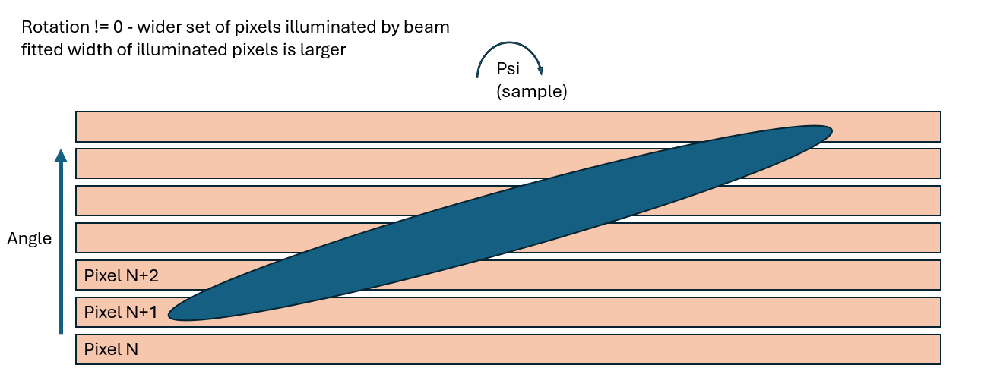
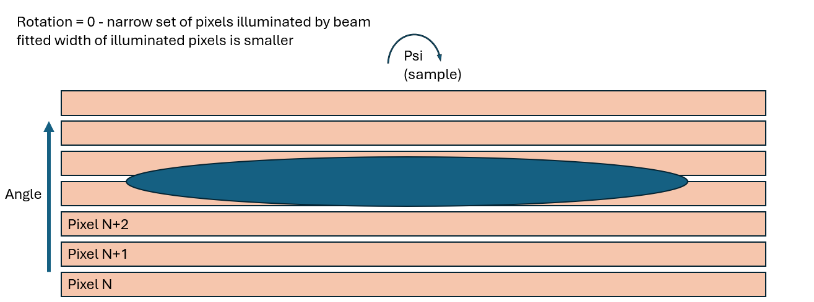

# Psi scanning

On a reflectometer, the Psi parameter is a rotation of the sample, side-to-side as viewed from a neutron's perspective.
The Psi parameter causes the reflected beam profile, which can be approximated as an elongated ellipse, to be rotated
when viewed at the detector. Reflectometers want to align the beam such that the beam profile is parallel to detector
pixels (or, in other words, a horizontal line as seen on the detector).

Psi does not get _redefined_ to zero when the beam is level, but reflectometers do need to know what value of Psi
_causes_ the beam to be level. The value of Psi which causes the beam to be level will be different for each sample,
because of differences in how each sample is mounted.

## Linear detectors

This section applies to instruments like OFFSPEC and POLREF, which have a 1-D bank of detectors. These pixels are much
wider than they are tall; representative pixel sizes are `0.5 x 50mm` on OFFSPEC or `0.5 x 30mm` on POLREF.

A linear pixel configuration means that as Psi is varied, the beam profile reflected off the sample(dark blue) hits a
different number of detector pixels (light orange):

For a linear detector, the optimum value of Psi occurs when the beam profile is focused onto the smallest number of
pixels (when the beam profile is parallel to the pixels).

A Psi scan on a linear detector is therefore implemented using the following steps:
- Physically scan over Psi
- At each scan point (implemented by {py:obj}`~ibex_bluesky_core.devices.reflectometry.AngleMappingReducer`:
  - Count & acquire a spectrum-data map describing the counts in all detector pixels
  - Filter to a range of interesting pixels (for example using {py:obj}`~ibex_bluesky_core.utils.centred_pixel`)
  - Map those pixels to relative angle, to account for pixel spacing which may not be exactly even between all pixels
  - Optionally divide counts in each pixel by a flood map, to account for different pixel efficiencies
  - Fit angle against counts using a {py:obj}`~ibex_bluesky_core.fitting.Gaussian` model
  - Return the fit parameters, including {py:obj}`~~ibex_bluesky_core.devices.reflectometry.AngleMappingReducer.sigma`
(width) as the data from each scan point
- Plotting the returned sigma (width) parameter at each scan point against the scanned variable, Psi, the optimum value
of Psi occurs when the width is minimised
  - This is performed using an _outer_ {py:obj}`~ibex_bluesky_core.fitting.Gaussian` fit, using standard
[callbacks and fitting](/callbacks/fitting/fitting) infrastructure. This is expected to give a negative
{py:obj}`~ibex_bluesky_core.fitting.Gaussian` curve, where the `x0` parameter describes the optimum value of Psi
